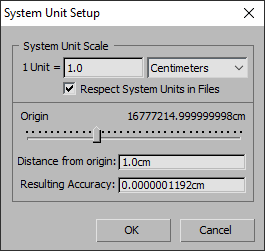
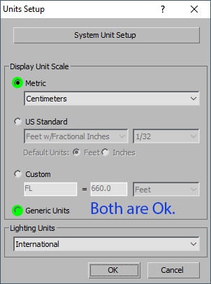
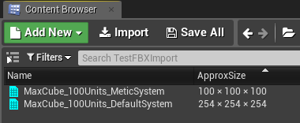
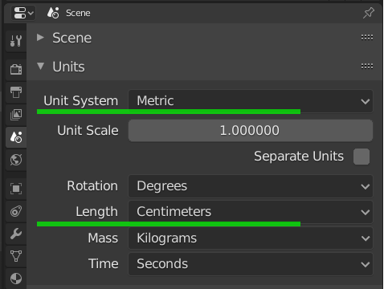

# FBX DCC Export Options

Generally DDC tool setup is consist of two parts: system unit setup to match UE4 unit system and FBX Exporter options setup. Both of these steps are used to make our asset import to UE4 "visual" predictable in position, orientation, size and without any tech errors. Other words - we want to get resulting UE4 asset looks the same as in our DCC tool.

## 3dsmax

### System Unit Setup

By default 3dsmax generic unit is inch, so a Cube with 100x100x100 would be 254x245x254 cm in UE4. Follow to **Customize > Units Setup... > System Unit Setup** to change system unit to **cm**. 

*Display Unit Scale* could be left as *Generic Units* (to prevent cm suffix appearing in 3dsmax numeric fields) or you can switch it to Metric(cm) for visual clearity or consistency with system unit setup.

| System Unit Setup  |                  |
|--------------------|------------------|
| System Unit Scale  | 1 unit = 1 cm    |
| Display Unit Scale | Generic / Metric |

After this setup you can see the difference in import results:

### FBX Exporter Tweaks

|**Smoothing Groups [ON]**|
|---|
|FBX Export: Include >> Geometry|
This options require to prevent warning *"No smoothing group information was found in this FBX scene."* Basicly it's not an error but it's always better to have clean export without any errors or warnings. 

## Maya

### System Unit Setup

Maya default generic unit is cm so there is no need in any tweaks here - 1 Maya unit would be 1 UE4 unit.

### FBX Exporter Tweaks

|**Smoothing Groups [ON]**|
|---|
|FBX Export: Include >> Geometry|
This options require to prevent warning *"No smoothing group information was found in this FBX scene."* Basicly it's not an error but it's always better to have clean export without any errors or warnings.

## Blender

### System Unit Setup

Blender default *system* generic unit is **cm** and it's ok but *display unit scale* is **m** (meter) so 1x1x1 Blender unit Cube would be 100х100х100 cm in UE4. This is similar with 3dsmax system/display unit scale setup. 

First change **Scene >> Units >> Unit System** to **Metric**.

Second (for "display unit scale") change **Length** options to **Centimeters**.

### FBX Exporter Tweaks

|**Smoothing [Edge/Face]**|
|---|
|Export FBX: Geometries|
This options require to prevent warning *"No smoothing group information was found in this FBX scene."* Basicly it's not an error but it's always better to have clean export without any errors or warnings.