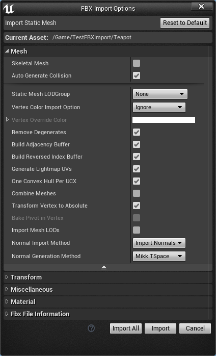

# FBX Import Options Reference

## Static Mesh Options

| Option                       | Description                                                                                                                                                                                                                                                                                                                                                                                                      |
|------------------------------|------------------------------------------------------------------------------------------------------------------------------------------------------------------------------------------------------------------------------------------------------------------------------------------------------------------------------------------------------------------------------------------------------------------|
| Mesh                         |                                                                                                                                                                                                                                                                                                                                                                                                                  |
| Skeletal Mesh                | Для Static Mesh: переключит импорт FBX файла в качестве Skeletal Mesh The import options will switch to handle importing the FBX file as a Skeletal Mesh.                                                                                                                                                                                                                                              |
| Auto Generate Collision      | This will automatically generate collision for your Static Mesh. This will not be used if custom collision is detected in the FBX file.                                                                                                                                                                                                                                                                          |
| Subdivision Surface          | Whether to subdivide the incoming FBX meshes surface.                                                                                                                                                                                                                                                                                                                                                            |
| Static Mesh LODGroup         | This dropdown allows you to choose the LOD group to which the mesh will be assigned. Mesh LOD groups define default level-of-detail settings, light map resolution, and permit global overrides (e.g. reduce all SmallPropLODs by 10%). Mesh LOD group settings may be overridden per-platform / device profile. You may select an LOD group at import time and change it at any time in the Static Mesh Editor. |
| Vertex Color Import Option   | If enabled, vertex colors on an existing mesh are replaced with the vertex colors from the FBX file. Disable this to preserve vertex colors painted within the editor using the Mesh Paint tool.                                                                                                                                                                                                                 |
| Vertex Override Color        | This will be override color in the case that Vertex Color Import Option is set to Override.                                                                                                                                                                                                                                                                                                                      |
| Remove Degenerates           | If enabled, degenerate triangles found during import will be removed. Disabling this option will keep degenerate triangles found. In general, this option should be enabled.                                                                                                                                                                                                                                     |
| Build Adjacency Buffer       | If true, the mesh will be optimized for PN tessellation. It is recommended to disable for larger meshes.                                                                                                                                                                                                                                                                                                         |
| Build Reveresed Index Buffer | This is used to reduce the number of GPU state changes between drawcalls. This is required to optimize a mesh in mirrored transform. It will also double the index buffer size.                                                                                                                                                                                                                                  |
| Generate Lightmap UVs        | If enabled, the importer will generate a set of unique, non-overlapping, UVs for use with static lighting.                                                                                                                                                                                                                                                                                                       |
| One Convex Hull per UCX      | This option forces all UCX meshes to receive one convex hull. If disabled, then a UCX mesh could be decomposed by the engine into a series of convex hulls to get the appropriate shape.                                                                                                                                                                                                                         |
| Transform Vertex to Absolute | If true, the FBX file will use the transform, offset, and pivot for the world origin. If false, the FBX will import without any node heirarchy transform.                                                                                                                                                                                                                                                        |
| Bake Pivot in Vertex         | If true, the pivot rotation will be applied to the mesh. The pivot of the FBX file will then be the origin of the mseh. Transform Vertex to Absolute must be set to false.                                                                                                                                                                                                                                       |
| Import Mesh LODs             | If true, creates LOD models for Unreal meshes from LODs in the import file. If false, only the base mesh from the LOD group is imported.                                                                                                                                                                                                                                                                         |
| Normal Import Method         | Enabling this option will read the tangents (tangent, binormal, normal) from the FBX file instead of generating them automatically.                                                                                                                                                                                                                                                                              |
| Normal Generation Method     | The option to choose between MikkTSpace or Built-in Normal generation method.                                                                                                                                                                                                                                                                                                                                    |
| Combine Meshes               | If enabled, all Static Meshes contained in the FBX scene are combined into a single Static Mesh.                                                                                                                                                                                                                                                                                                                 |