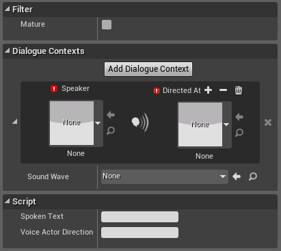

# Обзор аудио системы UE4
ver. 4.12

Аудиосистема UE4 состоит из нескольких компонентов, работающих совместно для создания звукового опыта игрока. Когда вы импортируете аудиофайл в движок, а затем располагаете созданный ассет звука на уровне, для настройки будут доступны различные свойства, такие как базовые уровни громкости или высоты тона, а также более точные настройки, такие как затухание звука, которое определяет, как мы слышим звук в зависимости от нашей удаленности от его источника.

UE4 также позволяет создавать составные звуки в форме ассетов **Sound Cues** в одноименном инструменте **Sound Cue Editor**, которые позволяют комбинировать звуки, а также применять модификаторы, называемые Sound Nodes, для изменения финального звучания. На этой странице описаны дополнительные элементы, которые используются для определения того, как звучит или воспроизводится звук, а ссылки на дополнительную документацию можно найти в соответствующих разделах.

## Импорт аудио файлов
Импортированные в проекта аудио файлы становятся ассетами типа **Sound Wave**, которые  могут быть напрямую добавлены на карту(уровень), или могут быть использованы для создания Sound Cue (*звуковой сигнал*), который в свою очередь настраивается в **Sound Cue Editor**.

Спецификация и порядок импорт аудио файлов приведен на странице [Аудио файлы](Audio.md)

## Типы звуковых ассетов

Помимо Sound Wave ассетов, получаемых прямым импортом аудио файлов в проект, мы можем создавать серию комплексных ассетов звука, служащих для различных задач озвучивания игры.

### Sound Cue
Sound Cue (*Звуковые сигналы*) - это составные звуки, которые позволяют изменять поведение воспроизведения звука, комбинировать звуковые эффекты и применять аудио-модификаторы с помощью звуковых нод для изменения финального вывода.

### Sound Attenuation
Ассет Sound Attenuation позволяет описать затухания звука и многократно ссылаться на него в свойствах других ассетов, избегая необходимости регулировки затухания для каждого звука в отдельности. Его можно рассмтаривать как своего рода профиль/пресет затухания.

### Reverb Effects
Reverb Effects (эффекты реверберации) - это ассет, который может быть определен для описаня нескольких свойств, которые легко настраивать и примнять к любому **Audio Volume** на уровен. В частности доступны для настройки такие эффекты как плотность эха, поглощение воздуха, общий уровень реверберации и т.д.

### Sound Class
Sound Class - это коллекция свойств, которые могут быть назначены к некоторому числу звуковых ассетов.

Свойства внутри такого класса выступают в качестве коэффициентов(мультипликаторов) к уже существующим значениям, и они будут учтены во всех ассетах, отнесенных к этому классу.

Также доступно построение иерархии классов с помощью добавления дочерних классов Child Classes, что дает возможность  передавать от родительского к дочернему классу только определенные свойства. Создание иерархии происходит в Sound Class Editor, нодовый интерфейс которого повторяет подобный в Sound Cue Editor.

Помимо этого, вы можете добавлять **Passive Sound Mixes** в Sound Class, их воспроизведение будет автоматически активироваться с воспроизведение класса (например, автоматическое понижение громкости музыки во время проигрывания диалогового Sound Class'a)

### Sound Mix

Звуковые миксы позволяют вам установить EQ Settings (настройки эквалайзера) и изменить громкость и высоту звука для Sound Class'ов.

Множество миксов могут быть активированы одновременно,таким образом каждый из них вносит свой вклад в общий аудио эффект. Вы можете **Push**(Активировать) или **Pop**(Деактивировать) миксы непосредственно в Blueprint с помощью нод **Push Sound Mix Modifier / Pop Sound Mix Modifier**, также вы можете пассивно активировать миксы и проигрывать их одновременно с некоторым Sound Class в пределах определенного предела.

Однако использование Push/Pop метода очень быстро может усложнить работу, если приходится перелючаться между большим количиством миксов. Тут нам на помощь приходит Blueprint нода **Set Sound Mix Override**. В ней мы можем назначить использование активного микса с любым имеющимся Sound Class'ами и настроить перетекание(интерполяцию) между текущим и целевым Sound Class'ами. *Другими словами вы переопределяете(override) Sound Class, назначенный этому миксу*.

Затем вы также можете вернуть микс к оригинальным настройкам, используя ноду **Clear Sound Mix Class Override**.

Открыв по двойному клику Sound Mix ассет в Content Browser, мы получим доступ к его собственным свойствам. Здесь мы можем изменить настройки эквалайзера (высокие, средние и низкие частоты, а также общий уровень усиления). Так как настройки множества миксов не могут быть скомбинированы, то для контроля того, свойства какого микса и в какой момент времени будут активны, используется опция EQ Priority.

Внутри раздела *Sound Classes* указываются классы, на которые должен оказываеть влияние микс. Здесь дла каждого класса мы можем выставить поправки громкости и высоты, указать настройки для дочерних классов, а также изменить **VoiceCenterChannelVolume**.

В разделе Sound Mix мы можем определить, как настройки микса будут накладываться или выключаться. Delay указывает задержку в активации свойства микса. Fade in Time и Fade out Time определяет плавность добавления и затухания определенного свойства микса. По истечению времени, указанного в **Duration** микс автоматически деактивирует себя - так значение в "-1" отключает автоматическую деактивировацию (pop) и пассивно назначенные миксы также не будут автоматически деактивироваться.

### Dialogue Voice and Dialogue Wave
**Dialogue Voice** и **Dialogue Wave** ассеты используются для генерации внутри-игровых диалоговых событий, создания субтитров, а также дополняют средства локализации.

Для созданного **Dialogue Voice** ассета мы можем указать род и число  актера озвучивания (*Gender & Plurality*) и, несмотря на то, что вы не указываете ни на один аудио ассет внутри *Dialogue Voice*, информация указанная здесь может быть использована внутри ассета *Dialogue Wave*. 

**Dialogue Wave** предоставляет бОьшее количество опций и именно здесь создается связь между аудио и говорящим/слушателем. Также здесь устанавливается соотношение между аудио диалогом и соотвествующим ему тексту субтитров. Dialogue Wave представляет собой одну строку диалога, а сердцем настроек ассета является раздел Dialogue Contexts.

Внутри раздела Dialogue Contexts в соотвествующих блоках вы можете назначить говорящего - **Speaker** и того/тех, на кого будет направлен этот диалог **Directed At**. Непосредственно ассет аудио-строки диалога указывается в свойстве Sound Wave.

В случае, когда один и тот же диалог вариативно могут "произносить" несколько актёров, то вы можете добавить новую "пару(ы)" Speaker/DirectredAt по нажатию на клавишу **Add Dialogue Context**.

!!!note
    Ассет Dialogue Wave может быть назначен Sound Cue с помощью ноды Dialogue Player внутри Sound Cue Editor. Также вы можете напрямую обратиться к Dialogue Wave из Blueprint, используя ноды **Play Dialogue at Location** и **Play Dialogue Attached**.

Дополнительно в разделе **Filter** вы можете применить флаг *Mature* для обозначения того, что диалог содержит mature/adult контент.

В разделе **Script** в поле *Spoken Text* вы можете указать текст, произносимый в диалоге.

!!!note
    ENGINE UPDATE / UE 4.22 :
    Опция **Subtitle Override** позволяет указать текст локализации субтитров, отличный от оригинального(англ.) языка.

Поле **Voice Actor Direction** может быть использовано для добавления указаний/пояснений для локализации или для актёра озвучки.

[HowTo: Пример использования Dialogue Voices / Waves](https://docs.unrealengine.com/en-US/Engine/Audio/Dialogue)

## Стратегия работы со звуком

### Общие рекомендации по громкости
